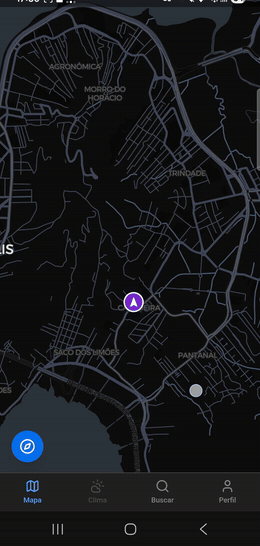
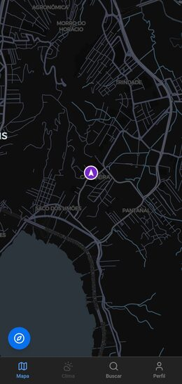
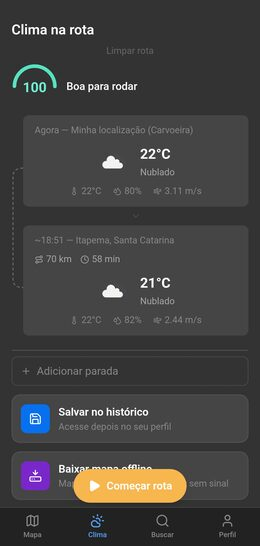
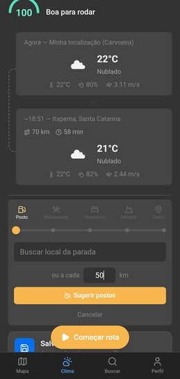
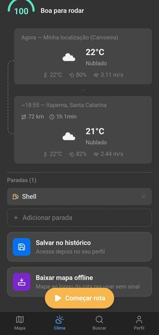
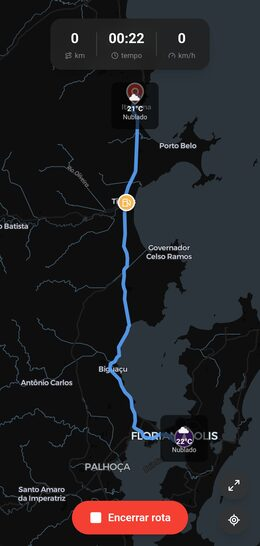
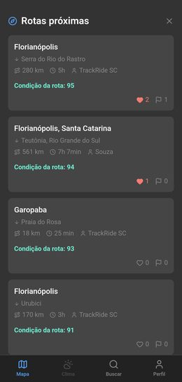

<div align="center">

# TrackRide

**Planejador de rotas de moto com clima por trecho.**

Cruza o traçado da rota com a previsão do tempo no horário em que você vai passar em cada ponto,
calcula um score de segurança, sugere paradas e funciona offline no meio da estrada.

[](https://svelte.dev)
[](https://www.typescriptlang.org)
[](https://rubyonrails.org)
[](https://postgis.net)
[](https://capacitorjs.com)



</div>

Projeto pessoal, de uso real. Ando de moto em SC e queria algo que cruzasse rota com previsão
do tempo antes de sair, não só o clima do destino, mas de cada trecho no horário que vou estar
passando ali.

## Telas

<table>
  <tr>
    <td align="center"><br /><sub><b>Mapa</b><br />Posição ao vivo, tema escuro</sub></td>
    <td align="center"><br /><sub><b>Clima na rota</b><br />Score e previsão por ponto</sub></td>
    <td align="center"><br /><sub><b>Postos</b><br />Sugestão a cada X km</sub></td>
  </tr>
  <tr>
    <td align="center"><br /><sub><b>Paradas</b><br />Salvar e baixar offline</sub></td>
    <td align="center"><br /><sub><b>Em rota</b><br />Distância, tempo e velocidade</sub></td>
    <td align="center"><br /><sub><b>Explorar</b><br />Rotas públicas por proximidade</sub></td>
  </tr>
</table>

## O que ele faz

**Clima por trecho.** A rota é amostrada a cada 90 km e cada ponto consulta a previsão para o
horário estimado de chegada ali, não para agora. Uma rota de 5 horas mostra o tempo que você
vai pegar no fim dela, não o que está fazendo na sua janela.

**Score de segurança.** Nota de 0 a 100 que combina chuva, vento, visibilidade e sensação
térmica, ajustada pela preferência de pilotagem (tranquilo, misto ou esportivo).

**Rastreamento ao vivo.** Segue o trajeto real com a câmera inclinada e girando na direção da
moto, detecta saída de rota com margem de 25 metros e recalcula. Continua rodando com a tela
bloqueada, via plugin nativo de background location.

**Modo offline.** Antes de sair, baixa os tiles do mapa num corredor ao longo do traçado e
guarda um pacote da rota no IndexedDB. Sem sinal na estrada, o app continua funcionando; os
percursos encerrados entram numa fila e sincronizam quando a rede volta.

**Paradas e postos.** Sugere postos reais do OpenStreetMap a cada X km de autonomia da moto,
usando os postos já marcados como âncora para não duplicar sugestão em trecho já coberto.

**Rotas públicas.** Consulta por proximidade em PostGIS mostra rotas que outras pessoas
compartilharam num raio de 80 km, com curtidas e contador de quem já percorreu.

## Por que essa stack?

**SvelteKit + Svelte 5.** Queria testar Svelte em algo real. É leve, o bundle é pequeno, e a reatividade com runes ($state, $derived) é simples de entender. Pra um app mobile-first que precisa ser rápido, fez sentido.

**Ruby on Rails 8.1 (API mode).** Produtividade. Levantar autenticação, CRUD, PostGIS, jobs e mailer em Rails é rápido. Não precisava de nada mais complexo pro backend.

**Capacitor.** Esse era o teste principal. Queria saber se dá pra pegar um app SvelteKit rodando no browser e empacotar como app Android nativo sem reescrever nada. Spoiler: funciona. GPS, haptics e background location, tudo via plugin nativo, com fallback pro browser.

A ideia era validar se Capacitor serve como caminho de migração pra mobile em projetos web existentes, sem precisar de React Native ou Flutter.

## Stack

- **Frontend:** SvelteKit 2, Svelte 5, TypeScript, Tailwind CSS 4, Skeleton UI
- **Backend:** Rails 8.1 API-only, Ruby 3.3
- **Banco:** PostgreSQL 16 + PostGIS 3.4
- **Mobile:** Capacitor 6 (Android)
- **Mapas:** MapLibre GL JS + OSRM (rotas) + Photon (geocoding)
- **Clima:** OpenWeatherMap (free tier)
- **Infra local:** Docker Compose (PostgreSQL/PostGIS + Redis + Mailpit)

## Estrutura

```
TrackRide/
├── frontend/          # SvelteKit + Capacitor
├── backend/           # Rails API
├── scripts/           # dev.sh, preview.sh
├── docker-compose.yml # PostgreSQL/PostGIS + Redis + Mailpit
└── .kiro/             # Contexto e regras do projeto
```

## Setup local

```bash
# Infra (banco, redis, mailpit)
docker compose up -d

# Backend
cd backend && bundle install && rails db:create db:migrate db:seed && rails s -p 3000 -b 0.0.0.0

# Frontend
cd frontend && npm install && npm run dev

# Ou tudo junto:
./scripts/dev.sh
```

Para testar no celular (preview + APK):
```bash
./scripts/preview.sh
cd frontend && npm run cap:build  # gera APK debug
```

## Premissas

- Apenas APIs e libs gratuitas/open source
- Escopo geográfico: Brasil
- Uso pessoal (sem Play Store por enquanto)
